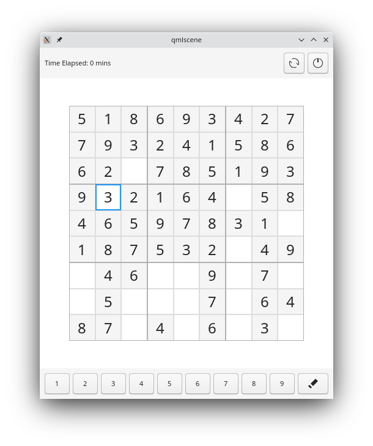

# Sudoku
A simple implemetation of Sudoku

## Screenshot

## How to Run
`qmlscene --fullscreen sudoku.qml`

## How to play
  - The objective is to fill a 9 × 9 grid with digits so that each column, each row, and each of the nine 3 × 3 subgrids that compose the grid  contain all of the digits from 1 to 9.
  - Click on an empty cell or use keyboard arrow keys to highlight a cell
  - Click on the buttons at bottom to fill a value or press 1-9 keyboard buttons to fill value
  - Click on erase button at bottom to clear a cell or press delete keyboard button to clear a cell
  - Learn more about Sudoku here : https://www.wikihow.com/Solve-a-Sudoku
  
## Attributions
  - All sounds are acquired from https://freesound.org licensed under [Creative Commons 3.0](https://creativecommons.org/licenses/by-nc/3.0/legalcode)
